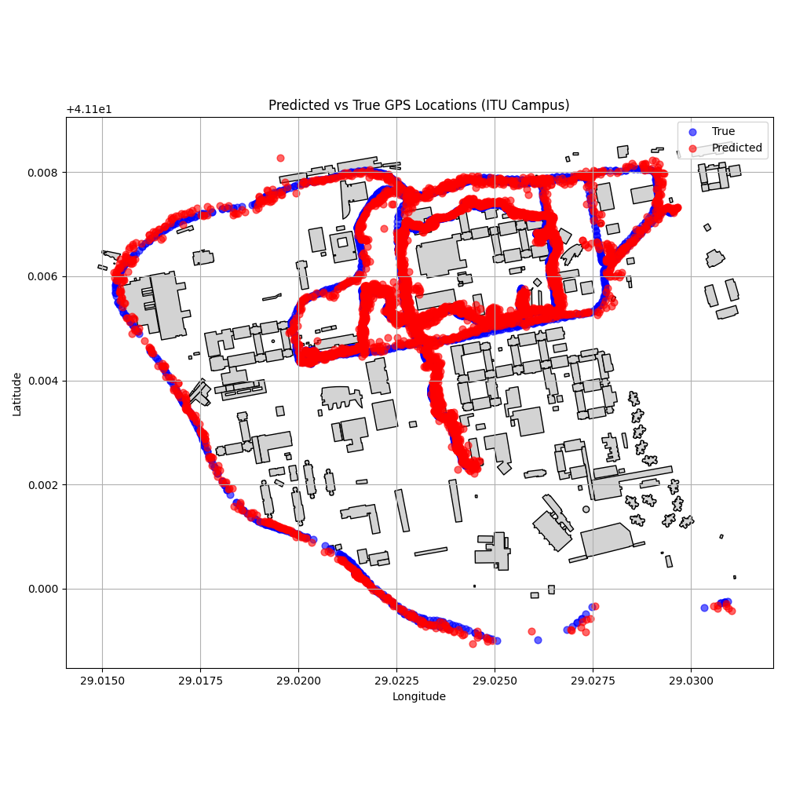

# 📡 5G Positioning with Structured Fusion Network (SFN)

A deep learning-based 5G localization system trained on real signal measurements from the **ITU Ayazağa Campus**.  
This project fuses per-base-station predictions using a **Structured MLP architecture** and an **uncertainty-aware late fusion mechanism**, inspired by state-of-the-art academic research.

---

## 🧠 Based On

This project combines insights from two key papers:

- **Comiter et al., 2017** – *"A Structured Deep Neural Network for Data-Driven Localization in Wireless Networks"*  
  → Introduced a modular MLP architecture trained per base station

- **Foliadis et al., 2024** – *"Deep Learning based Positioning with Multi-task Learning and Uncertainty-based Fusion"*  
  → Proposed late fusion of predictions using confidence/uncertainty weights for improved positioning accuracy

---


## 🔍 Project Highlights

✅ Real 5G signal logs (RSRP, SINR, etc.)  
✅ True GPS labels from device logs  
✅ Modular deep learning design  
✅ Per-BS training + fusion network  
✅ GIS visualization over ITÜ campus  
✅ Fully reproducible training & evaluation pipeline

---

## 🏗️ Project Structure

```
5g_positioning_sfn/
├── data/                 # All raw and processed datasets
│   ├── raw/              # Excel signal logs + GIS shapefiles
│   ├── processed/        # Merged/cleaned datasets
│   └── temp/             # Temporary scratch data
│
├── notebooks/            # EDA and map visualization
│   └── 01_data_exploration.ipynb
│
├── src/                  # Core source code
│   ├── data_loader.py
│   ├── feature_engineering.py
│   ├── train.py
│   ├── evaluate.py
│   ├── inference.py
│   └── models/
│       ├── structured_mlp.py
│       ├── fusion.py
│       └── utils.py
│
├── config/               # Model settings / metadata
│   └── settings.yaml
├── outputs/              # Model weights, results, and map plots
├── requirements.txt
└── README.md
```

---

## 🚀 How to Run It

### 🛠️ 1. Setup Environment

```bash
git clone https://github.com/AlehsanAliyev/5G-Positioning-SFN.git
cd 5G-Positioning-SFN
pip install -r requirements.txt
```

---

### 📦 2. Preprocess Signal Features

```bash
python src/feature_engineering.py
```

---

### 🧠 3. Train the Model

```bash
python src/train.py
```

This trains a per-base-station MLP on real GPS-labeled signal data and saves:
- Model weights: `outputs/checkpoints/mlp_real_gps.pth`
- Scaler: `y_scaler.pkl`

---

### 📊 4. Evaluate and Visualize

```bash
python src/evaluate.py
```

Output:
- 🔢 RMSE score on real data
- 🗺️ Campus overlay: `outputs/plots/map_prediction_overlay.png`
- 📄 Predictions: `outputs/results/fused_predictions.csv`

---

### 🔮 5. Inference

```bash
python src/inference.py
```

Predicts location for a single signal sample using the trained model.

---

## 🗺️ Visualization Preview

> Real vs Predicted positions plotted over the ITÜ campus buildings using shapefile overlays.



---

## 📚 References

- **[Comiter et al., 2017]**  
  *A Structured Deep Neural Network for Data-Driven Localization in Wireless Networks*  
  [IEEE Xplore](https://ieeexplore.ieee.org/document/7990132)

- **[Foliadis et al., 2024]**  
  *Deep Learning based Positioning with Multi-task Learning and Uncertainty-based Fusion*  
  IEEE Journal on Machine Learning in Communications and Networking

- **ITU Ayazağa Campus Dataset**  
  Provided as part of the **2025 5G Konumlandırma Yarışması**

---

## 🤝 Acknowledgements

Special thanks to the ITÜ 5G team and competition organizers for making this data available, and to the authors of the referenced papers for inspiration and direction.

---

## 📬 Contact

**Alehsan Aliyev**  
📧 [alehsan.aliev@gmail.com]  
🔗 GitHub: [@AlehsanAliyev](https://github.com/AlehsanAliyev)


